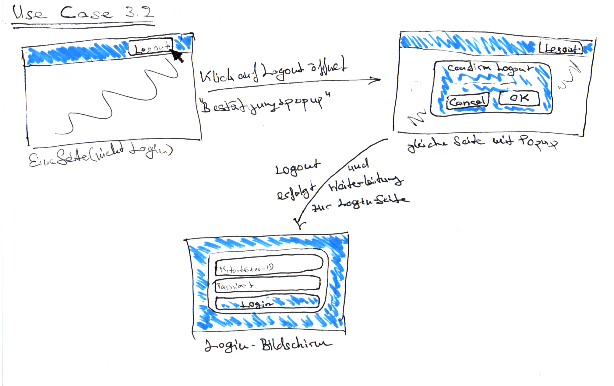

Projekt: Online-Mitarbeiterverwaltung

Auftraggeber:\
   Softwaretechnik Praktikum 2020\
   Hochschule Kempten\
   Bahnhofstr. 61, 87435 Kempten

Auftragnehmer:\
   Team D\
   Hochschule Kempten\
   Bahnhofstr. 61, 87435 Kempten

# Bedienkonzept

## UC3.1 Login

## Startseite und Menüführung

### Mitarbeiter

Die Use Cases "Einstempeln", "Ausstempeln" und "Letzten Zeitstempel anzeigen" sind direkt in die Startseite integriert. Falls es beim Stempeln Komplikationen gibt, kann unter dem "Einstempeln/Ausstempeln"-Button eine Warnung mit entsprechenden Optionen angezeigt werden (dies wird im Bedienkonzept zu den entsprechenden Use Cases beschrieben).

In der oberen rechten Ecke werden zusätzlich zum hier abgebildeten "Logout"-Button noch der Benutzername des angemeldeten Mitarbeiters sowie die Rolle (Mitarbeiter/Personalsachbearbeiter), in der dieser angemeldet ist, angezeigt

Unter "Meine Statistiken" findet der Mitarbeiter alle Auswertungsfunktionen zu seiner eigenen Arbeitszeit:

### Personalsachbearbeiter

Dem Personalsachbearbeiter wird ein zusätzlicher Menüpunkt "Personalmanagement" eingeblendet, unter dem er alle für ihn reservierten Funktionen findet:

Unter "Statistiken" kann der Personalsachbearbeiter Auswertungen zur Arbeitszeit der anderen Mitarbeiter durchführen:

## Use Cases

### AP1

#### UC1.1 Mitarbeiter anlegen

#### UC1.2 Mitarbeiter suchen

Im Gegensatz zur obigen Darstellung wird in der Benutzeroberfläche des Produkts kein "Optionen"-Dropdown verwendet, sondern die passenden Optionen werden direkt als Icons dargestellt.

#### UC1.3 Mitarbeiterdaten ändern

#### UC1.4 Mitarbeiter deaktivieren

#### UC1.5 Mitarbeiter aktivieren

### AP2

#### UC2.1 Fehltag hinzufügen

#### UC2.2 Fehltage ändern

#### UC2.3 Fehltage löschen

#### UC2.4 Filtereinstellungen ändern

#### UC2.5 Sortierverfahren ändern

#### UC2.6 Mitarbeiter auswählen

### AP4

#### UC4.1 Einstempeln

#### UC4.2 Ausstempeln

#### UC4.3 Letzten Zeitstempel anzeigen

#### UC4.4 Zeitstempel auflisten

#### UC4.5 Zeitstempel bearbeiten

### AP5

#### UC5.1 Anwesenheitstableau aufrufen

#### UC5.2 Eigene Arbeitstage-Jahresübersicht aufrufen

#### UC5.3 Beliebige Arbeitstage-Jahresübersicht aufrufen

### AP6

#### UC6.1 Eigene Jahres-Stunden-Übersicht einsehen

#### UC6.2 Eigenen aktuellen Stundensaldo einsehen

#### UC6.3 Jahres-Stunden-Übersicht eines bestimmten Mitarbeiters einsehen

#### UC6.4 Stundensaldo von bestimmten Mitarbeiter einsehen

## UC3.2 Logout

