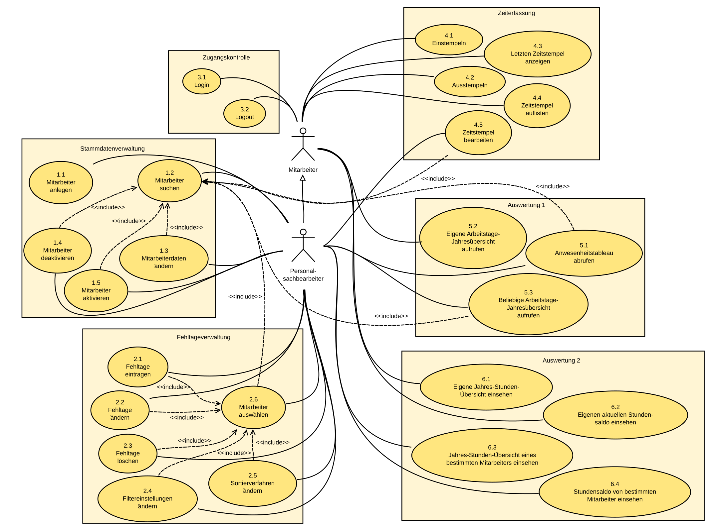

Projekt: Online-Mitarbeiterverwaltung

Auftraggeber:\
   Softwaretechnik Praktikum 2020\
   Hochschule Kempten\
   Bahnhofstr. 61, 87435 Kempten

Auftragnehmer:\
   Team D\
   Hochschule Kempten\
   Bahnhofstr. 61, 87435 Kempten

**Versionen**

 | **Version**  | **Datum**   | **Kommentar**   |**Status**  |
 |------------- |-----------  |---------------- |------------|
 | 1.0          | 05.04.2020    |Erster Entwurf   |draft       |
-----

**Inhaltsverzeichnis**
<!-- TOC -->

- [Zielbestimmung](#zielbestimmung)
    - [Musskriterien](#musskriterien)
    - [Wunschkriterien](#wunschkriterien)
    - [Abgrenzungskriterien](#abgrenzungskriterien)
- [Produkteinsatz](#produkteinsatz)
    - [Anwendungsbereich](#anwendungsbereich)
    - [Glossar](#glossar)
    - [Zielgruppen](#zielgruppen)
    - [Betriebsbedingungen](#betriebsbedingungen)
- [Funktionale Anforderungen](#funktionale-anforderungen)
    - [Übersicht](#übersicht)
    - [Detailbeschreibung Use-Cases](#detailbeschreibung-use-cases)
    - [Offene Punkte](#offene-punkte)
- [Produkteigenschaften](#produkteigenschaften)
    - [Systemumgebung](#systemumgebung)
    - [Benutzbarkeit](#benutzbarkeit)
    - [Effizienz](#effizienz)
    - [Wartbarkeit und Portierung](#wartbarkeit-und-portierung)
    - [Sicherheitsanforderungen](#sicherheitsanforderungen)
    - [Normen und gesetzliche Anforderungen](#normen-und-gesetzliche-anforderungen)
- [Produktdaten](#produktdaten)
- [Ergänzungen](#ergänzungen)

<!-- /TOC -->

# Zielbestimmung

## Musskriterien

Hier werden alle Kriterien beschreiben, die das Produkt können muss,
damit es für den vorgegebenen Einsatzzweck verwendet werden kann.

#### Mitarbeiter

  * Ein Mitarbeiter muss sich im System einloggen können.
  * Ein Mitarbeiter muss sich aus dem System ausloggen können.
  * Ein Mitarbeiter muss sich einstempeln können.
  * Ein Mitarbeiter muss sich ausstempeln können.
  * Ein Mitarbeiter muss seinen letzten Zeitstempel sehen können.
  * Ein Mitarbeiter muss sich seine Zeitstempel, zu einem frei gewählten Zeitraum, auflisten lassen können.
  * Ein Mitarbeiter muss eine Jahresübersicht über seine Arbeitstage aufrufen können.
  * Ein Mitarbeiter muss seine Jahres-Stunden-Übersicht aufrufen können.
  * Ein Mitarbeiter muss seinen aktuellen Stundensaldo sehen können.

#### Personalsachbearbeiter

  * Ein Personalsachbearbeiter muss einen neuen Mitarbeiter anlegen können.
  * Ein Personalsachbearbeiter muss Mitarbeiterdaten ändern können.
  * Ein Personalsachbearbeiter muss einen Mitarbeiter deaktivieren können.
  * Ein Personalsachbearbeiter muss Fehltage eines Mitarbeiters eintragen können.
  * Ein Personalsachbearbeiter muss Fehltage eines Mitarbeiters ändern können.
  * Ein Personalsachbearbeiter muss Fehltage eines Mitarbeiters löschen können.
  * Ein Personalsachbearbeiter muss einen Zeitstempel eines Mitarbeiters ändern können.
  * Ein Personalsachbearbeiter muss ein Anwesenheitstableau aufrufen können.
  * Ein Personalsachbearbeiter muss eine Jahresübersicht über die Arbeitstage eines Mitarbeiters aufrufen können.
  * Ein Personalsachbearbeiter muss die Jahres-Stunden-Übersicht eines Mitarbeiters aufrufen können.
  * Ein Personalsachbearbeiter muss den aktuellen Stundensaldo eines Mitarbeiters einsehen können.

#### System

  * Das System muss die Benutzerrollen **Mitarbeiter** und **Personalsachbearbeiter** zur Verfügung stellen. Ein Personalsachbearbeiter ist ein Mitarbeiter mit Besonderen Rechten.
  * Deutsch als Sprache
  * Erweiterbarkeit des Systems um weitere Sprachen
  * Erweiterbarkeit des Systems um weitere Benutzerrollen
  * Erweiterbarkeit des Systems um weitere Funktionen
  * Webbasiert (Von jedem Rechner und von überall aus verwendbar.)

## Wunschkriterien

Hier werden alle Kriterien beschrieben, die das Produkt können sollte,
um die Wünsche an das zu entwickelnde Produkt so gut wie möglich zu erfüllen.

  * Einheitliches GUI
  * Hilfe-Seite mit Erklärungen zur Anwendung.

## Abgrenzungskriterien

Folgende Ziele werden bei dem neuen Produkt bewusst **nicht** verfolgt:

  * Kommunikationsplattform für Mitarbeiter
  * Online Anträge (z.b.: Urlaub nehmen, Homeoffice, sonstige Verträge oder Abstimmungen)

# Produkteinsatz

## Anwendungsbereich
* Anwendung in jedem Unternehmen, welches eine Zeiterfassung benötigt
* Zusammenarbeit mit Mitarbeiterverwaltung möglich (Gehaltsabrechnung möglich, durch vorhandenen Daten wie: Gehalt, Stunden, Fehltage,...)

## Glossar

* MA -> Mitarbeiter

## Zielgruppen
* Jeder Mitarbeiter muss die Software verwenden, deshalb sollte sie auch möglichst einfach gehalten werden und übersichtlich. Damit sicher jeder schnell zurecht finden kann.

## Betriebsbedingungen
* Software läuft 24/7, beziehungsweise kann auch runtergefahren werden, wenn dass Unternehmen geschlossen hat.
* Software läuft unbeaufsichtigt.

# Funktionale Anforderungen

## Übersicht

Im nachfolgenden Diagramm sind alle Use Cases, Nutzer und Beziehungen zwischen diesen abgebildet. Die Datenbankanbindungen werden aus Übersichtsgründen nicht dargestellt und können den einzelnen Use Cases entnommen werden.

## Detailbeschreibung Use-Cases

**/UC1.1/ Mitarbeiter anlegen**

**Übersicht**

  |||
 ---------------|---------------------------------------------------------------
  Ziel          | Anlegen eines neuen Mitarbeiters im System
  Vorbedingung  | Der Nutzer ist als Personalsachbearbeiter im System angemeldet; Startbildschirm der Anwendung wird angezeigt
  Resultat      | Neuer Mitarbeiter ist im System angelegt; Startbildschirm der Anwendung wird angezeigt
  Nutzer        | Personalsachbearbeiter
  Auslöser      | Funktion "Neuen Mitarbeiter anlegen" ausgewählt
  ------------------------------------------------------------------------------

**Detailbeschreibung**

**Kurzbeschreibung**: Der Personalsachbearbeiter kann einen neuen Mitarbeiter im System anlegen

**Akteure**:
* Personalsachbearbeiter
* Personal-Datenbank

**Eingehende Daten**:
* Persönliche Daten des anzulegenden Mitarbeiters (Name, Vorname, Geburtsdatum, Geschlecht)
* Kontaktdaten des anzulegenden Mitarbeiters (Adresse, Email, Telefonnummer)
* Rolle des anzulegenden Mitarbeiters (Mitarbeiter/Personalsachbearbeiter)
* Wochenarbeitszeit in Stunden (Standard 40), Urlaubstage pro Jahr (Standard 25) 
* Passwort

**Essentielle Schritte**:
1. Nutzer wählt Funktion "Mitarbeiter anlegen" aus
2. System zeigt "Mitarbeiter anlegen"-Eingabeformular an
3. Nutzer gibt Mitarbeiterdaten ein
4. Nutzer wählt Funktion "Bestätigen" aus
5. System prüft, ob alle Felder Daten enthalten
6. System prüft, ob alle eingegebenen Daten zulässig sind
7. System übermittelt die eingegebenen Daten zum Anlegen eines neuen Mitarbeiters an die Personal-Datenbank
8. Personal-Datenbank legt mit den erhaltenen Daten einen neuen Mitarbeiter an und weist diesem eine generierte ID zu
9. System zeigt für 2 Sekunden die Meldung "Mitarbeiter erfolgreich angelegt" an
10. System zeigt Startbildschirm der Anwendung an

**Ausnahmen**:
* zu 3. und 4.: Nutzer wählt Funktion "Abbrechen" aus
  * 3a) weiter zu Schritt 10.
* zu 5.: Falls nicht alle benötigten Daten eingegeben wurden:
  * 5a) System gibt Meldung aus, welche Felder noch ausgefüllt werden müssen
  * 5b) weiter bei Schritt 2.
* zu 6.: Falls nicht alle eingegebenen Daten zulässig sind:
  * 6a) System gibt Meldung aus, welche Felder mit unzulässigen Daten ausgefüllt wurden und fordert den Nutzer auf, diese zu korrigieren
  * 6b) weiter bei Schritt 2.
* zu 8.: Falls beim Einfügen in die Datenbank ein Fehler auftritt, z.B. Verletzung eines Unique-Constraints
  * 8a) Datenbank übermittelt dem System die Fehlermeldung
  * 8b) System gibt dem Nutzer die Meldung aus, dass der Mitarbeiter nicht angelegt werden konnte, sowie (falls möglich) den Grund
  * 8c) weiter bei Schritt 2.

**Änderungshistorie**
* 06.04.2020; Samuel Pfalzer; Anwendungsfall angelegt
* 06.04.2020; Samuel Pfalzer; Nummerierung angepasst, Tippfehler verbessert
* 16.04.2020; Samuel Pfalzer; "Pflichtfelder" durch "Felder" ersetzt, weil hier alle Felder Pflichtfelder sind
* 16.04.2020; Samuel Pfalzer; Arbeitszeit- und Gehaltsbezogene Eingangsdaten hinzugefügt
* 25.04.2020; Samuel Pfalzer; Arbeitszeit und ID-Vergabe angepasst, Passwort-Anlage hinzugefügt

**/UC1.2/ Mitarbeiter suchen**

**Übersicht**

  |||
 ---------------|---------------------------------------------------------------
  Ziel          | Suchen eines bestimmten im System angelegten Mitarbeiters
  Vorbedingung  | Der Nutzer ist als Personalsachbearbeiter im System angemeldet; Startbildschirm der Anwendung wird angezeigt
  Resultat      | Liste der Mitarbeiter, auf die die angegebenen Suchkriterien zutreffen, wird angezeigt
  Nutzer        | Personalsachbearbeiter
  Auslöser      | Use Case 1.3/1.4/1.5/2.6/4.5/5.1/5.3 gestartet
  ------------------------------------------------------------------------------

**Detailbeschreibung**

**Kurzbeschreibung**: Der Personalsachbearbeiter sucht anhand bestimmter Kriterien einen im System angelegten Mitarbeiter

**Akteure**:
* Personalsachbearbeiter
* Personal-Datenbank

**Eingehende Daten**:
* Suchkriterien (Name oder ID des gesuchten Mitarbeiters)

**Essentielle Schritte**:
1. System zeigt Mitarbeiter-Suchmaske an
2. Nutzer gibt Namen oder ID des gesuchten Mitarbeiters ein
3. Nutzer wählt Funktion "Suche starten" aus
4. System sucht alle Mitarbeiter, auf die die Suche zutrifft, aus der Datenbank und zeigt sie in Form einer Liste an, in der zu jedem Eintrag passende Icons zu Interaktion je nach Aufrufkontext assoziiert sind (z.B. Stift für "Bearbeiten" und "Aktivieren"/"Deaktivieren"-Toggle beim Aufruf im Kontext der Mitarbeiterverwaltung)

**Ausnahmen**:
* zu 2., 3., 4.: Nutzer wählt Funktion "Abbrechen" aus
  * 2a) System zeigt Startbildschirm der Anwendung an
* zu 4.: Falls kein Mitarbeiter gefunden wurde, auf den die Suchkriterien zutreffen
  * 4a) System gibt Meldung aus, dass der gesuchte Mitarbeiter nicht gefunden wurde
  * 4b) weiter bei Schritt 2.

**Änderungshistorie**
* 06.04.2020; Samuel Pfalzer; Anwendungsfall angelegt
* 06.04.2020; Samuel Pfalzer; Nummerierung angepasst + Tippfehler verbessert
* 22.04.2020; Samuel Pfalzer; für Zusammenarbeit mit anderen Use Cases angepasst
* 25.04.2020; Samuel Pfalzer; Optionen-Darstellung angepasst

**/UC1.3/ Mitarbeiterdaten ändern**

**Übersicht**

  |||
 ---------------|---------------------------------------------------------------
  Ziel          | Bestimmte Stammdaten eines im System existierenden Mitarbeiters, die fehlerhaft sind, werden geändert
  Vorbedingung  | Nutzer ist als Personalsachbearbeiter im System angemeldet; eine Liste von Mitarbeitern wird als Ergebnis des zuvor erfolgreich durchgeführten Anwendungsfalls 1.2 (Mitarbeiter suchen) angezeigt
  Resultat      | Bestimmte Daten eines im System existierenden Mitarbeiters wurden geändert; Startbildschirm der Anwendung wird angezeigt
  Nutzer        | Personalsachbearbeiter
  Auslöser      | Funktion "Bearbeiten" zu einem bestimmten Mitarbeiter ausgewählt
  ------------------------------------------------------------------------------

**Detailbeschreibung**

**Kurzbeschreibung**: Der Personalsachbearbeiter kann bestimmte Stammdaten eines Mitarbeiters im System ändern

**Akteure**:
* Personalsachbearbeiter
* Personal-Datenbank

**Eingehende Daten**:
* Neue Werte für zu ändernde Datenfelder

**Essentielle Schritte**:
1. Nutzer wählt Funktion "Bearbeiten" zu einem bestimmten Mitarbeiter aus
2. System zeigt "Mitarbeiterdaten ändern"-Eingabeformular an, das nur die änderbaren Daten des ausgewählten Mitarbeiters enthält (z.B. nicht ID des Mitarbeiters)
3. Nutzer ändert gewünschte Mitarbeiterdaten im Formular
4. Nutzer wählt Funktion "Bestätigen" aus
5. System prüft, ob alle Felder Daten enthalten
6. System prüft, ob alle eingegebenen Daten zulässig sind
7. System übermittelt die eingegebenen Daten zum Ändern des Mitarbeiters an die Personal-Datenbank
8. Personal-Datenbank ändert die erhaltenen Daten beim angegebenen Mitarbeiter
9. System zeigt für 2 Sekunden Meldung "Mitarbeiterdaten erfolgreich geändert" an
10. System zeigt Startbildschirm der Anwendung an

**Ausnahmen**:
* zu 3., 4.: Nutzer wählt Funktion "Abbrechen" aus
  * 3a) weiter bei Schritt 10.
* zu 5.: Falls nicht alle benötigten Daten eingegeben wurden:
  * 5a) System gibt Meldung aus, welche Felder noch ausgefüllt werden müssen
  * 5b) weiter bei Schritt 2.
* zu 6.: Falls nicht alle eingegebenen Daten zulässig sind:
  * 6a) System gibt Meldung aus, welche Felder mit unzulässigen Daten ausgefüllt wurden und fordert den Nutzer auf, diese zu korrigieren
  * 6b) weiter bei Schritt 2.

**Änderungshistorie**
* 06.04.2020; Samuel Pfalzer; Anwendungsfall angelegt
* 06.04.2020; Samuel Pfalzer; Nummerierung angepasst
* 16.04.2020; Samuel Pfalzer; "Pflichtfelder" durch "Felder" ersetzt, weil hier alle Felder Pflichtfelder sind

**/UC1.4/ Mitarbeiter deaktivieren**

**Übersicht**

  |||
 ---------------|---------------------------------------------------------------
  Ziel          | Ein im System angelegter Mitarbeiter, der die Firma verlassen hat, wird deaktiviert
  Vorbedingung  | Nutzer ist als Personalsachbearbeiter im System angemeldet; eine Liste von Mitarbeitern wird als Ergebnis des zuvor erfolgreich durchgeführten Anwendungsfalls 1.2 (Mitarbeiter suchen) angezeigt
  Resultat      | Ein bestimmter Mitarbeiter ist im System deaktiviert und kann sich somit nicht mehr einloggen; Startbildschirm der Anwendung wird angezeigt
  Nutzer        | Personalsachbearbeiter
  Auslöser      | Funktion "Mitarbeiter deaktivieren" ausgewählt
  ------------------------------------------------------------------------------

**Detailbeschreibung**

**Kurzbeschreibung**: Der Personalsachbearbeiter deaktiviert einen Mitarbeiter, der die Firma verlassen hat, im System

**Akteure**:
* Personalsachbearbeiter
* Personal-Datenbank

**Essentielle Schritte**:
1. Nutzer wählt Funktion "Deaktivieren" zu einem bestimmten Mitarbeiter aus
2. System zeigt Dialog "Mitarbeiter \[Name\] wirklich deaktivieren?" an
3. Nutzer wählt Funktion "Bestätigen" aus
4. System übermittelt die Aufforderung, den ausgewählten Mitarbeiter zu deaktivieren, an die Personaldatenbank
5. Personal-Datenbank ändert den Status des angegebenen Mitarbeiters auf "deaktiviert", wodurch sich der entsprechende Mitarbeiter beim nächsten Versuch nicht mehr anmelden kann
6. System zeigt für 2 Sekunden Meldung "Mitarbeiter \[Name\] deaktiviert" an
7.  System zeigt Startbildschirm der Anwendung an

**Ausnahmen**:
* zu 1., 3.: Nutzer wählt Funktion "Abbrechen" aus
  * 3a) weiter bei Schritt 7.

**Änderungshistorie**
* 06.04.2020; Samuel Pfalzer; Anwendungsfall angelegt
* 06.04.2020; Samuel Pfalzer; Nummerierung angepasst
* 25.04.2020; Samuel Pfalzer; Folgen der Deaktivierung hinzugefügt

**/UC1.5/ Mitarbeiter aktivieren**

**Übersicht**

  |||
 ---------------|---------------------------------------------------------------
  Ziel          | Ein im System angelegter Mitarbeiter, der momentan deaktiviert ist, wird aktiviert
  Vorbedingung  | Nutzer ist als Personalsachbearbeiter im System angemeldet; eine Liste von Mitarbeitern wird als Ergebnis des zuvor erfolgreich durchgeführten Anwendungsfalls 1.2 (Mitarbeiter suchen) angezeigt
  Resultat      | Ein bestimmter Mitarbeiter ist im System aktiviert und kann sich wieder im System anmelden; Startbildschirm der Anwendung wird angezeigt
  Nutzer        | Personalsachbearbeiter
  Auslöser      | Funktion "Mitarbeiter aktivieren" ausgewählt
  ------------------------------------------------------------------------------

**Detailbeschreibung**

**Kurzbeschreibung**: Der Personalsachbearbeiter aktiviert einen Mitarbeiter, der zuvor deaktiviert war, im System

**Akteure**:
* Personalsachbearbeiter
* Personal-Datenbank

**Essentielle Schritte**:
1. Nutzer wählt Funktion "Aktivieren" zu einem bestimmten Mitarbeiter aus
2. System zeigt Dialog "Mitarbeiter \[Name\] wirklich aktivieren?" an
3. Nutzer wählt Funktion "Bestätigen" aus
4. System übermittelt die Aufforderung, den ausgewählten Mitarbeiter zu aktivieren, an die Personaldatenbank
5. Personal-Datenbank ändert den Status des angegebenen Mitarbeiters auf "aktiviert"
6. System zeigt für 2 Sekunden Meldung "Mitarbeiter \[Name\] aktiviert" an
7.  System zeigt Startbildschirm der Anwendung an

**Ausnahmen**:
* zu 1., 3.: Nutzer wählt Funktion "Abbrechen" aus
  * 3a) weiter bei Schritt 7.

**Änderungshistorie**
* 16.04.2020; Samuel Pfalzer; Anwendungsfall angelegt
* 25.04.2020; Samuel Pfalzer; Folgen der Aktivierung hinzugefügt

**/UC2.1/ Fehltage eintragen**

**Übersicht**

  |||
 ---------------|---------------------------------------------------------------
  Ziel          | Eintragen von Fehltagen eines Mitarbeiters
  Vorbedingung  | Ein Mitarbeiter wurde durch den Usecase "Mitarbeiter auswählen" ausgewählt
  Resultat      | Einem Mitarbeiter wurde mindestens ein Fehltag hinzugefügt
  Nutzer        | Personalsachbearbeiter
  Auslöser      | Auswahl von „Fehltag(e) hinzufügen“
  ------------------------------------------------------------------------------

**Detailbeschreibung**

**Kurzbeschreibung:** Der Nutzer trägt zu einem bestimmten Mitarbeiter neue Fehltage ein.

**Akteure:** 
  * Personalsachbearbeiter
  * Zeiterfassungs-Datenbank

**Eingehende Daten:** 

*	Datum von bis
*	Grund des Fehlens
    *	Kein Grund
    *	Erkrankung
    *	Homeoffice
    *	Urlaub
    * Zeitausgleich

**Vorbedingung:** Ein Mitarbeiter wurde durch den Usecase "Mitarbeiter auswählen" ausgewählt

**Nachbedingung** Dem Nutzer werden die hinzugefügten Fehltage angezeigt

**Essenzielle Schritte:**
1.  Nutzer klickt bei einem ausgewählten Mitarbeiter auf „Fehltag(e) hinzufügen“
2.	System zeigt „Fehltag hinzufügen“-Eingabeformular an
3.	Nutzer gibt Zeitrahmen des Fehlens an (eintägig durch zweimal selbes Datum)
4.	Nutzer gibt Grund des Fehlens an
5.	Nutzer bestätigt Auswahl
6.	System überprüft die eingegebenen Daten auf Gültigkeit
7.	System übergibt die eingegebenen Daten an die Zeiterfassungs-Datenbank
8.  Zeiterfassungs-Datenbank erstellt einen neuen Eintrag mit den empfangenen Daten
9.	System zeigt die hinzugefügten Fehltage mit einer Meldung, dass der Vorgang erfolgreich war

**Ausnahmen**

Zu 3., 4. Und 5.: Nutzer klickt auf "Abbrechen":

  *	Breche Vorgang ab und zeige vorherige Seite an.

Zu 3.: Falls angegebener Zeitrahmen ungültig:

  *	3a) Hinweis, dass Zeitrahmen ungültig ist

Zu 6.: Falls immer noch ungültige Eingabewerte vorhanden sind:

  *	Auf der Seite bleiben und auf die entsprechenden Werte verweisen.

Zu 8.: Falls bereits ein oder mehrere Einträge im gleichen Zeitrahmen vorhanden sind:

  * 8a) System zeigt eine Warnung an, dass bereits Fehltage in diesem Zeitrahmen vorhanden sind und verweigert das hinzufügen
  * 8b) Weiter mit Schritt 3

**Änderungshistorie:** 
  * 06.04.2020; Gianni Rota; Anwendungsfall angelegt
  * 07.04.2020; Gianni Rota; Nummerierung angepasst und Copy&Paste Fehler entfernt.
  * 07.04.2020; Gianni Rota; Akteur Zeiterfassungs-Datenbank hinzugefügt; Essenzielle Schritte und Ausnahmen verbessert;
  * 08.04.2020; Gianni Rota; Vorbedingung und Titel überarbeitet;
  * 22.04.2020; Gianni Rota; Vorbedingung überarbeitet;
  * 24.04.2020; Gianni Rota; Ausnahmen überarbeitet;

**/UC2.2/ Fehltage ändern**

**Übersicht**

  |||
 ---------------|---------------------------------------------------------------
  Ziel          | Ändern von Fehltagen eines Mitarbeiters
  Vorbedingung  | Fehltage eines Mitarbeiters werden angezeigt (Usecase Mitarbeiter auswählen)
  Resultat      | Die Werte bestehender Fehltage eines Mitarbeiters wurden geändert
  Nutzer        | Personalsachbearbeiter
  Auslöser      | Auswahl von „Fehltag(e) bearbeiten“
  ------------------------------------------------------------------------------

**Detailbeschreibung**

**Kurzbeschreibung:** Der Nutzer ändert die Werte bestehender Fehltage eines Mitarbeiters.

**Akteure:** 
  * Personalsachbearbeiter
  * Zeiterfassungs-Datenbank

**Eingehende Daten:** 

*	Datum von bis
*	Grund des Fehlens
    *	Kein Grund
    *	Erkrankung
    *	Homeoffice
    *	Urlaub
    * Zeitausgleich
    
    
**Vorbedingung:** Fehltage eines Mitarbeiters werden angezeigt (Usecase Mitarbeiter auswählen)

**Nachbedingung** Dem Nutzer werden die geänderten Fehltage angezeigt

**Essenzielle Schritte:**
1. 	Nutzer klickt auf „Fehltag(e) bearbeiten“
2.	System zeigt „Fehltage bearbeiten“-Eingabeformular an
3.	Nutzer ändert gewünschte Werte
4.	Nutzer bestätigt Auswahl
5.	System überprüft die eingegebenen Daten auf Gültigkeit
6.	System übergibt die eingegebenen Daten an die Zeiterfassungs-Datenbank
8.  Zeiterfassungs-Datenbank bearbeitet den entsprechenden Eintrag mit den empfangenen Daten
9.	System zeigt die bearbeiteten Fehltage an mit einer Meldung, dass der Vorgang erfolgreich war

**Ausnahmen**

Zu 3. und 4.: Nutzer klickt auf „Abbrechen“:

  * Breche Vorgang ab. Zeige vorherige Seite an.

Zu 5.: Falls ungültige Eingabewerte vorhanden sind:

  * Auf der Seite bleiben und auf die entsprechenden Werte verweisen.

Zu 8.: Falls bereits ein oder mehrere Einträge im gleichen Zeitrahmen vorhanden sind:

  * 8a) System zeigt eine Warnung an, dass bereits Fehltage in diesem Zeitrahmen vorhanden sind und verweigert das hinzufügen
  * 8b) Weiter mit Schritt 3

**Änderungshistorie:** 
  * 07.04.2020; Gianni Rota; Anwendungsfall angelegt
  * 07.04.2020; Gianni Rota; Akteur Zeiterfassungs-Datenbank hinzugefügt; Essenzielle Schritte und Ausnahmen verbessert;
  * 08.04.2020; Gianni Rota; Vorbedingung und Titel überarbeitet;
  * 22.04.2020; Gianni Rota; Vorbedingung überarbeitet;
  * 24.04.2020; Gianni Rota; Ausnahmen überarbeitet;

**/UC2.3/ Fehltage löschen**

**Übersicht**

  |||
 ---------------|---------------------------------------------------------------
  Ziel          | Löschen von Fehltagen eines Mitarbeiters
  Vorbedingung  | Fehltage eines Mitarbeiters werden angezeigt (Usecase Mitarbeiter auswählen)
  Resultat      | Ausgewählte Fehltage eines Mitarbeiters wurden gelöscht
  Nutzer        | Personalsachbearbeiter
  Auslöser      | Auswahl von „Fehltag(e) löschen“
  ------------------------------------------------------------------------------

**Detailbeschreibung**

**Kurzbeschreibung:** Der Nutzer löscht bestehende Fehltage eines Mitarbeiters.

**Akteure:** 
  * Personalsachbearbeiter
  * Zeiterfassungs-Datenbank

**Vorbedingung:** Fehltage eines Mitarbeiters werden angezeigt (Usecase Mitarbeiter auswählen)

**Nachbedingung** Dem Nutzer werden die übrigen Fehltage angezeigt

**Essenzielle Schritte:**
1. 	Nutzer klickt auf „Fehltag(e) löschen“
2.	Meldung, die eine Löschbestätigung fordert, anzeigen
3.	Nutzer bestätigt Auswahl
4.  System übergibt die information über den zu löschenden Eintrag an die Zeiterfassungs-Datenbank
5.	Zeiterfassungs-Datenbank löscht den zugehörigen Eintrag
6.	System zeigt die übrigen Fehltage an mit einer Meldung, dass der Vorgang erfolgreich war

**Ausnahmen**

Zu 3.: Nutzer klickt auf „Abbrechen“:

•	Löschvorgang abbrechen. Zeige vorherige Seite. 
  
**Änderungshistorie:** 
  * 07.04.2020; Gianni Rota; Anwendungsfall angelegt
  * 07.04.2020; Gianni Rota; Akteur Zeiterfassungs-Datenbank hinzugefügt; Essenzielle Schritte und Ausnahmen verbessert;
  * 08.04.2020; Gianni Rota; Vorbedingung und Titel überarbeitet;
  * 22.04.2020; Gianni Rota; Vorbedingung überarbeitet;

**/UC2.4/ Filtereinstellungen ändern**

**Übersicht**

  |||
 ---------------|---------------------------------------------------------------
  Ziel          | Filtereinstellungen den wünschen des Nutzers anpasssen
  Vorbedingung  | Fehltage eines Mitarbeiters werden angezeigt (Usecase Mitarbeiter auswählen)
  Resultat      | Die angezeigten Fehltage entsprechen den neuen Filtereinstellungen des Nutzers
  Nutzer        | Personalsachbearbeiter
  Auslöser      | Auswahl von „Filter“
  ------------------------------------------------------------------------------

**Detailbeschreibung**

**Kurzbeschreibung:** Der Nutzer grenzt die angezeigten Fehltage auf seine gewünschten Filtereingaben ein.

**Akteure:** 
  * Personalsachbearbeiter
  * Zeiterfassungs-Datenbank

**Eingehende Daten:** 

*	Zeitrahmen
    * Unbegrenzt (Standardeinstellung)
    * Tag
        * Datum
    * Woche
        * Kalenderwoche
        * Jahr
        * Datum
    * Monat
        * Monat
        * Jahr
    * Jahr
        * Jahr
    * Beliebiger Zeitrahmen
        * Datum von bis
* Grund des Fehlens
    * Alle  (Standardeinstellung)
    * Erkrankung
    * Homeoffice
    * Urlaub
    * Zeitausgleich

**Vorbedingung:** Fehltage eines Mitarbeiters werden angezeigt (Usecase Mitarbeiter auswählen)

**Nachbedingung** Dem Nutzer werden die (neu) gefilterten Fehltage angezeigt

**Essenzielle Schritte:**
1. 	Nutzer klickt auf „Ergebnisse Filtern“
2.	System zeigt Filter-Eingabeformular an
3.	Nutzer tätigt Filtereingaben
4.	Nutzer bestätigt Eingabe
5.	System überprüft die eingegebenen Daten auf Gültigkeit
6.  System speichert die Filtereinstellungen (bis zum Verlassen des Menüpunkts)
7.  System übergibt Filtereingaben an die Zeiterfassungs-Datenbank
8.	Zeiterfassungs-Datenbank sucht Fehltage unter Berücksichtigung der Filtereingaben
9.	System zeigt die gefilterten Datenbankergebnisse an unter Verwendung des aktuell gewählten Sortierverfahrens

**Ausnahmen**

Zu 5.: Falls Filtereingaben ungültig:

  * 5a) Hinweis, auf entsprechende Fehler (ungültiger Zeitrahmen, ungültiges Datum, ungültiger Monat, ungültige Kalenderwoche). 
  * 5b) Weiter mit Schritt 3.

Zu 8.: Falls keine Ergebnisse vorhanden:

  * 8a) System zeigt keine Ergebnisse an und weist darauf hin, dass keine Daten den Filtereingaben entsprechen.
  * 8b) Usecase Ende.

**Änderungshistorie:** 
  * 07.04.2020; Gianni Rota; Anwendungsfall angelegt;
  * 07.04.2020; Gianni Rota; Akteur Zeiterfassungs-Datenbank hinzugefügt; Essenzielle Schritte und Ausnahmen verbessert;
  * 08.04.2020; Gianni Rota; Eingehende Daten, Vorbedingung und Titel überarbeitet;
  * 19.04.2020; Gianni Rota; ungültige Filteringaben spezifiziert;
  * 22.04.2020; Gianni Rota; Eingehende Daten, Vorbedingung, Resultat, Essenzielle Schritte, Ausnahmen und Titel überarbeitet;

**/UC2.5/ Sortierverfahren ändern**

**Übersicht**

  |||
 ---------------|---------------------------------------------------------------
  Ziel          | Sortierverfahren ändern
  Vorbedingung  | Fehltage eines Mitarbeiters werden angezeigt (Usecase Mitarbeiter auswählen)
  Resultat      | Die angezeigten Fehltage entsprechen dem gewählten Sortierverfahren des Nutzers
  Nutzer        | Personalsachbearbeiter
  Auslöser      | Klicken auf "Sortieren"
  ------------------------------------------------------------------------------

**Detailbeschreibung**

**Kurzbeschreibung:** Der Nutzer ändert das Sortierverfahren seinen wünschen entsprechend.

**Akteure:** 
  * Personalsachbearbeiter

**Eingehende Daten:** 

  * Datum absteigend (Standardeinstellung)
  * Datum aufsteigend

**Vorbedingung:** Fehltage eines Mitarbeiters werden angezeigt (Usecase Mitarbeiter auswählen)

**Nachbedingung** Dem Nutzer werden die (neu) sortierten Fehltage angezeigt

**Essenzielle Schritte:**
1.  Nutzer klickt auf "Sortieren“
2.	System zeigt Sortierverfahren an
3.	Nutzer wählt Sortierverfahren
4.  System speichert die Sortiereinstellung (temporär)
5.	System zeigt die sortierten Ergebnisse an

**Ausnahmen**

Zu 2., 3.: Nutzer schließt die Auswahl des Sortierverfahrens:

  *	Breche Vorgang ab und zeige vorherige Seite an.

Zu 3.: Falls gleiches Sortierverfahren wie zuvor:

  *	3a) Zeige vorherige Seite an

Zu 5.: Falls keine Ergebnisse vorhanden

  * 5a) System zeigt keine Ergebnisse an und weist darauf hin.
  

**Änderungshistorie:** 
  * 19.04.2020; Gianni Rota; Anwendungsfall angelegt;
  * 20.04.2020; Gianni Rota; Eingehende Daten überarbeitet;
  * 22.04.2020; Gianni Rota; Titel, Vorbedingung, Kurzbeschreibung, Essenzielle Schritte, Offene Punkte und Resultat überarbeitet;

**/UC2.6/ Mitarbeiter auswählen**

**Übersicht**

  |||
 ---------------|---------------------------------------------------------------
  Ziel          | Auswählen eines bestimmten im System angelegten Mitarbeiters
  Vorbedingung  | Der Nutzer ist als Personalsachbearbeiter im System angemeldet; Startbildschirm der Anwendung wird angezeigt
  Resultat      | Liste der Fehltage eines ausgewählten Mitarbeiters
  Nutzer        | Personalsachbearbeiter
  Auslöser      | Funktion "Fehltageverwaltung" ausgewählt
  ------------------------------------------------------------------------------

**Detailbeschreibung**

**Kurzbeschreibung**: Der Personalsachbearbeiter sucht anhand bestimmter Kriterien einen im System angelegten Mitarbeiter und wählt diesen aus. Danach werden die Fehltage des gewählten Mitarbeiters aufgelistet.

**Akteure**:
* Personalsachbearbeiter
* Zeiterfassungs-Datenbank

**Eingehende Daten**:
* Suchkriterien (Name oder ID des gesuchten Mitarbeiters)

**Essentielle Schritte**:
1. Nutzer wählt Funktion "Fehltageverwaltung" aus
2. Usecase Mitarbeiter suchen 
3. Nutzer wählt durch klicken den gewünschten Mitarbeiter aus
4. System sucht alle Fehltage (unter Verwendung des standardmäßigen Filters), des enstprechenden Mitarbeiters, aus der Zeiterfassungs-Datenbank
5. System listet die Datenbankergebnisse (unter Verwendung des standardmäßig gewählten Sortierverfahrens) auf

**Ausnahmen**:

Zu 4.: Falls keine Ergebnisse vorhanden

  * 4a) System zeigt keine Ergebnisse an und weist darauf hin
  * 4b) Usecase ende

**Änderungshistorie**
* 22.04.2020; Gianni Rota; Anwendungsfall angelegt;

**/UC3.1/ Login**

|||
 ---------------|---------------------------------------------------------------
  Ziel          | Login
  Vorbedingung  | User ist bereits registriert
  Resultat      | User ist eingeloggt
  Nutzer        | jeder Mitarbeiter
  Auslöser      | User möchte sich einloggen
  ------------------------------------------------------------------------------

**Detailbeschreibung**

**Name:** Login 

**Kurzbeschreibung:** Der User loggt sich ein, damit dieser mit dem System arbeiten kann und die richtige Rolle (Mitarbeiter/Personalsachbearbeiter) zugewiesen bekommt

**Akteure:** Mitarbeiter, Session-Datenbank, Credentials-Datenbank

**Auslöser:** User möchte sich einloggen

**Ergebnisse:** User ist eingeloggt

**Eingehende Daten:** Mitarbeiter ID und zugehöriges Passwort (Credentials), Sitzungsinformationen

**Vorbedingung:** User ist bereits registriert

**Nachbedingung:** User bleibt bis zum Logout eingeloggt und er-/behält zugewiesene Zugriffsrechte

**Essenzielle Schritte:**
1.	User startet das Program
2.	Login Bildschirm wird angezeigt
3.	User gibt Mitarbeiter ID und zugehöriges Passwort ein und bestätigt per Buttonklick
4.	Prüfung, ob Credentials korrekt (vom System)
5.	Session wird für Nutzer angelegt
6.	Weiterleitung auf Startbildschirm

**Ausnahmen:** 

  *zu 4.:* Falls Passwort oder Mitarbeiter ID falsch
	
  4a) Meldung "Passwort oder Mitarbeiter ID falsch"
  
  *zu 4.:* Falls Mitarbeiter deaktiviert wurde
	
  4a) Meldung "Dieser Account wurde deaktiviert. Wenden Sie sich an einen Personalsachbearbeiter."

**Änderungshistorie:** 
* 04.04.2020; Andreas Schwarz; Use Case angelegt
* 07.04.2020; Andreas Schwarz; Schritt 2 bei Essenzielle Schritte hinzugefügt
* 08.04.2020; Andreas Schwarz; Nummerierung, Daten und Essenzielle Schritte geändert; Akteure hinzugefügt

**/UC3.2/ Logout**

|||
 ---------------|---------------------------------------------------------------
  Ziel          | Logout
  Vorbedingung  | User ist eingeloggt
  Resultat      | User ist ausgeloggt
  Nutzer        | jeder Mitarbeiter
  Auslöser      | User möchte sich ausloggen
  ------------------------------------------------------------------------------

**Detailbeschreibung**

**Name:** Logout 

**Kurzbeschreibung:** Der User loggt sich aus, damit niemand unberechtigten Zugriff hat

**Akteure:** Mitarbeiter, Session-Datenbank

**Auslöser:** User möchte sich ausloggen

**Ergebnisse:** User ist ausgeloggt

**Eingehende Daten:** Sitzungsinformationen

**Vorbedingung:** User ist eingeloggt

**Nachbedingung:** User hat keine Zugriffsrechte mehr, bis er sich wieder einloggt

**Essenzielle Schritte:**
1.	User klickt auf Logout
2.	Session wird zerstört
3.	User wird zur Login-Seite weitergeleitet

**Offene Punkte:** Wird der User nach gewisser Zeit automatisch ausgeloggt?
                   Wird der User nach Schliessung des Browsers ausgeloggt?

**Änderungshistorie:** 
* 04.04.2020; Andreas Schwarz
* 05.04.2020; Andreas Schwarz; Nummerierung, Daten und Essentielle Schritte geändert; Akteur hinzugefügt

**/UC4.1/ Einstempeln**

|||
 ---------------|---------------------------------------------------------------
  Ziel          | Einstempeln
  Vorbedingung  | Mitarbeiter hat sich identifiziert per ID/LogIn und hat sich zuvor ausgestempelt
  Resultat      | Mitarbeiter hat sich eingestempelt
  Nutzer        | Mitarbeiter
  Auslöser      | User wählt Funktion "Einstempeln" aus
  ------------------------------------------------------------------------------

**Detailbeschreibung**

**Name:** Einstempeln 

**Kurzbeschreibung:** Der User stempelt sich ein, um zu signalisieren, dass er da ist

**Akteure:** Mitarbeiter, Datenbank

**Auslöser:** -

**Ergebnisse:** Mitarbeiter ist eingestempelt

**Eingehende Daten:** Mitarbeiter ID; Datum und Uhrzeit 

**Vorbedingung:** -

**Nachbedingung:** -

**Essenzielle Schritte:**
1.  Funktion "einstempeln" auswählen
2.  System speichert Einstemplung mit aktuellem Datum und Uhrzeit (auf Datenbank)
3.  Startbildschirm wird angezeigt

**Sonstiges** 
Ausnahme zu 1. 
1: Einstempeln kann nicht ausgeführt werden, wenn zuvor nicht ausgestempelt wurde. Hat der Mitarbeiter das Austemplen zuvor vergessen (Vergessen, wenn 12 Stunden nachdem einstemplen nicht ausgestempelt wurde), hat er die Option sich trotzdem Einzustempeln mit dem Hinweis, sich bei der Personalabteilung zu melden.  
2: Ist der Mitarbeiter Erstnutzer fällt die Vorbedingung "hat sich zuvor ausgestempelt" weg

**Änderungshistorie:** 
* 03.04.2020; Kadim Özdemir
* 07.04.2020; Kadim Özdemir; Nummerierung, Vorbedingenen, Essenzielle Schritte, Auslöser angepasst

**/UC4.2/ Ausstempeln**

|||
 ---------------|---------------------------------------------------------------
  Ziel          | Ausstempeln
  Vorbedingung  | Mitarbeiter ist identifiziert per ID/LogIn und hat sich zuvor eingestempelt
  Resultat      | Mitarbeiter hat sich ausgestempelt
  Nutzer        | Mitarbeiter
  Auslöser      | User wählt Funktion "Ausstempeln" aus
  ------------------------------------------------------------------------------

**Detailbeschreibung**

**Name:** Ausstempeln 

**Kurzbeschreibung:** Der User stempelt sich aus, um zu signalisieren, dass er nicht da ist

**Akteure:** Mitarbeiter

**Auslöser:** Mitarbeiter startet das Programm und stempelt sich aus 

**Ergebnisse:** Mitarbeiter ist ausgestempelt

**Eingehende Daten:** Mitarbeiter ID; Datum und Uhrzeit 

**Vorbedingung:** -

**Nachbedingung:** -

**Essenzielle Schritte:**
1.	Funktion "ausstempeln" auswählen
2.  System speichert Einstemplung mit aktuellen Datum und Uhrzeit in der Datenbank
3.  Startbildschirm wird angezeigt

**Sonstiges**
Ausnahme zu 1. 
1: Ausstempeln kann nicht ausgeführt werden, wenn zuvor nicht eingestempelt wurde. Hat der Mitarbeiter das Einstemplen zuvor vergessen (Vergessen, wenn 12 Stunden nachdem ausstemplen nicht eingestempelt wurde), hat er die Option sich trotzdem Auszustempeln mit dem Hinweis, sich bei der Personalabteilung zu melden. Feiertage, Wochenendtage, Urlaubstage werden berücksichtigt.

**Änderungshistorie:** 
* 03.04.2020; Kadim Özdemir
* 07.04.2020; Kadim Özdemir; Nummerierung, Vorbedingenen, Essenzielle Schritte angepasst

**/UC4.3/ Letzten Zeitstempel anzeigen**

|||
 ---------------|---------------------------------------------------------------
  Ziel          | Letzten Zeitstempel anzeigen
  Vorbedingung  | Der Mitarbeiter ist identifiziert per ID/LogIn 
  Resultat      | Mitarbeiter sieht seinen letzten Zeitstempel
  Nutzer        | Mitarbeiter
  Auslöser      | Unmittelbar nach dem Login
  ------------------------------------------------------------------------------

**Detailbeschreibung**

**Name:** Letzten Zeitstempel anzeigen

**Kurzbeschreibung:** Der User bekommt seinen letzten Zeitstempel zu sehen, um etwaigen Missbrauch erkennen zu können

**Akteure:** Mitarbeiter, Datenbank

**Auslöser:** Mitarbeiter startet das Programm und klickt auf „letzter Zeitstempel“

**Ergebnisse:** Mitarbeiter bekommt seinen letzten Zeitstempel zu sehen

**Eingehende Daten:** Mitarbeiter ID; letzter Zeitstempel (Datum und Uhrzeit)

**Vorbedingung:** -

**Nachbedingung:** -

**Essenzielle Schritte:**
1.  Letzter Zeitstempel wird unmittelbar nach dem Login angezeigt

**Sonstiges**
Ausnahme zu 2.: User bekommt eine Meldung angezeigt,dass keine letzter Zeitstempel vorhanden sind, wenn er Erstnutzer ist.

**Änderungshistorie:** 
* 03.04.2020; Kadim Özdemir
* 07.04.2020; Kadim Özdemir; Nummerierung, Essenzielle Schritte angepasst

**/UC4.4/ Zeitstempel auflisten**

|||
 ---------------|---------------------------------------------------------------
  Ziel          | Zeitstempel auflisten
  Vorbedingung  | Der Mitarbeiter ist identifiziert per ID/LogIn 
  Resultat      | Mitarbeiter sieht eine Liste seiner Zeitstempel
  Nutzer        | Mitarbeiter
  Auslöser      | User klickt auf „Liste der Zeitstempel“ und wählt beliebigen Zeitraum aus
  ------------------------------------------------------------------------------

**Detailbeschreibung**

**Name:** Zeitstempel auflisten

**Kurzbeschreibung:** Der User bekommt zu einem frei wählbaren Zeitraum seine Zeitstempel aufgelistet, um sich einen Überblick zu verschaffen

**Akteure:** Mitarbeiter

**Auslöser:** Mitarbeiter startet das Programm, klickt auf „Liste der Zeitstempel“ und wählt beliebigen Zeitraum aus

**Ergebnisse:** Mitarbeiter bekommt eine Liste mit Zeitstempeln zu sehen

**Eingehende Daten:** Mitarbeiter ID; Zeitraum (Datum und Uhrzeit)

**Vorbedingung:** -

**Nachbedingung:** -

**Essenzielle Schritte:**
1.	User klickt auf „Liste von Zeitstempel“ drauf
2.	User wählt einen Zeitraum: Vom [Datum/Uhrzeit] bis [Datum/Uhrzeit]
3.	User bestätigt
4.	User sieht alle Zeitstempel im vorgegebenen Zeitraum

**Sonstiges** 
Ausnahme zu 4.: User bekommt eine Meldung angezeigt,dass keine Zeitstempel vorhanden sind, wenn er Erstnutzer ist.

**Änderungshistorie:** 
* 03.04.2020; Kadim Özdemir
* 07.04.2020; Kadim Özdemir; Nummerierung, Auslöser, Essenzielle Schritte angepasst

**/UC4.5/ Zeitstempel bearbeiten**

**Übersicht**

|||
 ---------------|---------------------------------------------------------------
  Ziel          | Zeitstempel bearbeiten
  Vorbedingung  | Der Personalsachbearbeiter ist identifiziert per ID/LogIn 
  Resultat      | Personalsachbearbeiter hat Zeitstempel eines Mitarbeiters bearbeitet
  Nutzer        | Personalsachbearbeiter
  Auslöser      | User wählt Funktion "Personalmanagement" aus
  ------------------------------------------------------------------------------
**Detailbeschreibung**

**Name:** Zeitstempel bearbeiten

**Kurzbeschreibung:** Der User kann einen Zeitstempel eines bestimmten Mitarbeiters ändern, damit Fehler beim Ausstempeln korrigiert werden können

**Akteure:** Personalsachbearbeiter, Datenbank

**Auslöser:** Personalsachbearbeiter startet das Programm und klickt auf "Personalmanagement"

**Ergebnisse:** Zeitstempel eines Mitarbeiters wurde bearbeitet

**Eingehende Daten:** Personalsachbearbeiter ID (Zugriffsrechte); Mitarbeiter ID

**Vorbedingung:** -

**Nachbedingung** Der überarbeitete Zeitstempel wird angezeigt

**Essenzielle Schritte:**
1.	User klickt auf „Personalmanagement“
2.  User sucht den Mitarbeiter (UC - Mitarbeiter suchen)
3.	User bekommt alle Zeitstempel des Mitarbeiters angezeigt
4.	User sucht und wählt einen Zeitstempel (UC - Zeitstempel auflisten)
5.  User bearbeitet diesen Zeitstempel
6.	User speichert die Änderungen

**Sonstiges** 
Ausnahme zu 3: Der Personalsachbearbeiter bekommt eine Meldung angezeigt,dass keine Zeitstempel vom Mitarbeiter vorhanden sind, wenn dieser ein Erstnutzer (neuer Mitarbeiter) ist.
Ausnahme zu 6: Falls es schon einen identischen Zeitstempel gibt, kommt eine Nachricht, dass dieser Stempel mit den Werten nicht gespeichert werden kann.

**Änderungshistorie:** 
* 03.04.2020; Kadim Özdemir
* 07.04.2020; Kadim Özdemir; Nummerierung, Auslöser, Essenzielle Schritte angepasst
* 23.04.2020; Kadim Özdemir; Sonstiges-Ausnahme hinzugefügt

**/UC05.1/ Anwesenheitstableau aufrufen**

**Übersicht**

  |||
 ---------------|---------------------------------------------------------------
  Ziel          |  *Einsicht der aktuellen Anwesenheit*
  Vorbedingung  |  *User ist als Personalsachbearbeiter eingeloggt; Startbildschirm der Anwendung wird angezeigt*
  Resultat      |  *User sieht wer momentan alles eingestempelt ist*
  Nutzer        |  *Personalsachbearbeiter* 
  Auslöser      |  *Nutzer wählt Funktion "Anwesenheitstableau" aus* 
  ------------------------------------------------------------------------------

**Detailbeschreibung**

**Kurzbeschreibung**  *Der Personalsachbearbeiter hat die Möglichkeit die anwesenheit aller Mitarbeiter einzusehen. Dadurch kann er überprüfen welche Mitarbeiter momentan alle eingestempelt sind.* 

**Akteure:**
* Personalsachbearbeiter
* Zeiterfassungs-Datenbank

**Eingehende Daten:** 
* Anmeldedaten des Personalsachbearbeiter (zum Einloggen)
* Auswahl des Nutzers, dass dieser Anwesenheitstableau ansehen möchte

**Essentielle Schritte:** 
1. Nutzer wählt Funktion "Anwesenheitstableau" aus
2. System ruft Zeiterfassungs-Datenbank auf und zeigt alle  Mitarbeiter an.
* ist ein Mitarbeiter momentan anwesend ist er grün markiert
* ist ein Mitarbeiter abwesend wird dieser rot markiert und der Grund (falls vorhanden) für sein fehlen steht dabei

**Änderungshistorie:**
* 06.04.2020; Jonathan Hilscher; Anwendungsfall angelegt
* 08.04.2020; Jonathan Hilscher; Tippfehler, Auslöser ergänzt;
* 21.04.2020; Jonathan Hilscher; farbliche Markierung ergänzt;

**/UC05.2/ Eigene Arbeitstage-Jahresübersicht aufrufen**

**Übersicht**

  |||
 ---------------|---------------------------------------------------------------
  Ziel          |  *eigene Arbeitstage-Jahresübersicht anzeigen lassen* 
  Vorbedingung  |  *User ist eingeloggt; Startbildschirm der Anwendung wird angezeigt*
  Resultat      |  *User sieht eine Liste allere seiner gearbeiteten Tage in der Jahresübersicht*
  Nutzer        |  *beliebiger Mitarbeiter*
  Auslöser      |  *Nutzer wählt "Jahres-Arbeitstageübersicht" und "Meine Statistiken" aus*
  ------------------------------------------------------------------------------

**Detailbeschreibung**

**Kurzbeschreibung** *Jeder beliebige Mitarbeiter kann alle seine Arbeitstage einsehen. In einer Wochen-/ Monats-/ und Jahresansicht* 

**Akteure:**
* Mitarbeiter
* Zeiterfassungs-Datenbank

**Eingehende Daten:** 
* Auswahl des Nutzers, dass dieser Arbeitstage-Übersicht sehen möchte
* Auswahl der Jahresübersicht

**Essentielle Schritte:** 
1. Nutzer wählt Funktion "Arbeitstage-Übersicht" aus
2. Nutzer wählt gewünschtes Jahr aus
3. Nutzer wählt die Jahresansicht aus
4. System übermittelt das gewünschte Jahr an die Zeiterfassungs-Datenbank
5. Zeiterfassungs-Datenbank übermittelt Daten an System
6. System zeigt Arbeitstage-Jahresübersicht
  * Tage an denen der Mitarbeiter Urlaub hatte, werden mit einem U markiert und farblich markiert
  * Tage an denen der Mitarbeiter wegen Krankheit fehlte, werden mit einem K markiert und farblich markiert
  * Tage an denen der Mitarbeiter gearbeitet hatt, werden mit einem A markiert und grün markiert

**Änderungshistorie:**
* 06.04.2020; Jonathan Hilscher; Anwendungsfall angelegt
* 08.04.2020; Jonathan Hilscher; Tippfehler beseitigt;
* 21.04.2020; Jonathan Hilscher; Kürzel bei Arbeitstage-Jahresübersicht hinzugefügt;

**/UC05.3/ Beliebige Arbeitstage-Jahresübersicht aufrufen**

**Übersicht**

  |||
 ---------------|---------------------------------------------------------------
  Ziel          |  *beliebige Arbeitstage-Jahresübersicht anzeigen lassen*
  Vorbedingung  |  *Personalsachbearbeiter ist eingeloggt; Startbildschirm der Anwendung wird angezeigt*
  Resultat      |  *Personalsachbearbeiter sieht eine Liste mit allen gearbeiteten Tage in der Jahresübersicht, eines gewünschten Mitarbeiters*
  Nutzer        |  *Personalsachbearbeiter* 
  Auslöser      |  *Nutzer wählt Funktion "Jahres-Arbeitstageübersicht" unter "Statistiken" aus* 
  ------------------------------------------------------------------------------

**Detailbeschreibung**

**Kurzbeschreibung** *Ein Personalsachbearbeiter kann einen beliebigen Mitarbeiter auswählen, von dem ihm die gesamten Arbeitstage, des gewünschten Miarbeiters angezeigt werden.* 

**Akteure:**
* Personalsachbearbeiter
* Zeiterfassungs-Datenbank

**Eingehende Daten:** 
* Auswahl des Nutzers, dass dieser Arbeitstage-Übersicht sehen möchte
* ID/ Name des gewünschten Mitarbeiters
* Auswahl der Jahresübersicht

**Essentielle Schritte:** 
1. Nutzer wählt Funktion "Arbeitstage-Übersicht" aus
2. Mitarbeiter suchen und auswählen (siehe UseCase Mitarbeiter suchen)
3. Nutzer wählt gewünschtes Jahr aus
4. Nutzer wählt die Jahresansicht aus
5. System übermittelt das gewünschte Jahr und gewünschten Mitarbeiter an die Zeiterfassungs-Datenbank
6. Zeiterfassungs-Datenbank übermittelt Daten an System
7. System zeigt Arbeitstage-Jahresübersicht
* Tage an denen der Mitarbeiter Urlaub hatte, werden mit einem U markiert und farblich markiert
  * Tage an denen der Mitarbeiter wegen Krankheit fehlte, werden mit einem K markiert und farblich markiert
  * Tage an denen der Mitarbeiter gearbeitet hatt, werden mit einem A markiert und grün markiert

**Ausnahmne**:

**Änderungshistorie:**
* 06.04.2020; Jonathan Hilscher; Anwendungsfall angelegt
* 08.04.2020; Jonathan Hilscher; Tippfehler, Essentielle Schritte 2. verbessert;
* 08.04.2020; Jonathan Hilscher; Essentielle Schritte 3. eingefügt;
* 21.04.2020; Jonathan Hilscher; Mitarbeiter suchen und wählen ergänzt; Kürzel bei Arbeitstage-Jahresübersicht hinzugefügt; 
* 21.04.2020; Jonathan Hilscher; Essentielle Schritte Nummerierung verbessert;

**/UC6.1/ Eigene Jahres-Stunden-Übersicht einsehen**

**Übersicht**

  |||
 ---------------|---------------------------------------------------------------
  Ziel          | Einsicht in eigene Jahres-Stunden-Übersicht
  Vorbedingung  | User ist als Mitarbeiter eingeloggt
  Resultat      | User weiß wie viele Stunden er pro Monat im aktuellen Jahr gearbeitet hat
  Nutzer        | Mitarbeiter
  Auslöser      | Übersicht auswählen, unter der Funktion Zeiterfassung
  ------------------------------------------------------------------------------

**Detailbeschreibung**

**Name:** Einsicht in eigene Jahres-Stunden-Übersicht

**Kurzbeschreibung:** Der User hat die Möglichkeit seine eigene Jahres-Stunden-Übersicht zu sehen. Dadurch weiß er wieviel er pro Monat gearbeitet hat, wieviel er arbeiten hätte sollen und was sein Stundensaldo in dem Monat war. Für jeden Monat wird eine Box dargestellt mit diesen Daten.

**Akteure:**
* Mitarbeiter
* Zeiterfassungsdatenbank

**Auslöser:** Mitarbeiter führt das Mitarbeiterzeiterfassungsprogramm aus und geht auf Zeiterfassung

**Ergebnisse:** Jahres-Stunden-Übersicht im angegebenen Jahr wird angezeigt

**Eingehende Daten:**
* Session ID
* Mitarbeiter ID
* Auswahl, dass der User Jahres-Stunden-Übersicht ansehen möchte
* Das ausgewählte Jahr (kann auch ein Standardwert existieren, sodass das Jahr nicht vom User explizit angegeben werden muss)

**Vorbedingung:** User ist als Mitarbeiter eingeloggt

**Nachbedingung** User ist immernoch als Mitarbeiter eingeloggt; Anzeigen der Ansicht für die Jahres-Stunden-Übersicht

**Essenzielle Schritte:**
  1. Use Case Login
  2. User klickt auf Zeiterfassung
  3. User klickt auf Übersicht
  4. Zeiterfassungsdatenbank gibt Jahres-Stunden-Übersicht des Mitarbeiters zurück
  5. Jahres Stunden Übersicht wird angezeigt

**Ausnahmen**
* zu 4: Falls noch keine Jahres-Stunden-Übersicht existiert:
  - 4a) Anzeigen, dass keine Jahres-Stunden-Übersicht existiert

* zu 4: Datenbankfehler jeglicher Art
  - 4b) Operationen abbrechen
  - 4c) User anzeigen, dass es einen Fehler gab und dass er es noch einmal versuchen soll. Falls dieser Fehler besteht soll er einen Administrator kontaktieren
  - 4d) Bei 2. fortsetzen

**Änderungshistorie:** 
* 01.04.2020; Fahri Korkmaz; Anwendungsfall angelegt
* 05.04.2020; Fahri Korkmaz; Auslöser genauer spezifiziert
* 05.04.2020; Fahri Korkmaz; Typo in "Eingehende Daten" verbessert
* 05.04.2020; Fahri Korkmaz; 4b) hinzugefügt
* 05.04.2020; Fahri Korkmaz; Eingehende Daten in Liste umgeändert
* 06.04.2020; Fahri Korkmaz; 1-4 gekürzt zu Login, da dies ein anderer Use Case ist. Dadurch fallen die Ausnahmen zu 4 auch raus.
* 06.04.2020; Fahri Korkmaz; Ergebnis überarbeitet
* 06.04.2020; Fahri Korkmaz; Zeiterfassungsdatenbank als Akteur hinzugefügt
* 06.04.2020; Fahri Korkmaz; 4 und 5 zu Essenzielle Schritte hinzugefügt
* 06.04.2020; Fahri Korkmaz; Ausnahmen zu 4. hinzugefügt
* 07.04.2020; Fahri Korkmaz; 4b entfernt
* 07.04.2020; Fahri Korkmaz; Use Case Nummerierung geändert
* 15.04.2020; Fahri Korkmaz; Beschreibung der Übericht hinzugefügt
* 15.04.2020; Fahri Korkmaz; Nutzer geändert
* 30.04.2020; Fahri Korkmaz; Use Case an Bedienkonzept angepasst

**/UC6.2/ Eigenen aktuellen Stundensaldo einsehen**

**Übersicht**

  |||
 ---------------|---------------------------------------------------------------
  Ziel          | Einsicht in eigenen aktuellen Stundensaldo
  Vorbedingung  | User ist als Mitarbeiter eingeloggt
  Resultat      | User sieht aktuellen Stundensaldo, sodass er entscheiden kann, ob er Überstunden hat
  Nutzer        | Mitarbeiter
  Auslöser      | Stundensaldo auswählen, unter Zeiterfassung
  ------------------------------------------------------------------------------

**Detailbeschreibung**

**Name:** Einsicht in eigenen aktuellen Stundensaldo

**Kurzbeschreibung:** Der User hat die Möglichkeit sein eigenen Stundensaldo abzufragen, damit er weiß ob er Überstunden hat. In der Stundensaldo ansicht sieht der User ein Tortendiagramm mit seinen Fehltagen, Arbeitstagen, genommenen Urlaubstagen und Gleitzeiten. Zudem sieht der User Informationen zu den Arbeitstagen, zu seinem Urlaub und zu seinem Stundensaldo.

**Akteure:** 
* Mitarbeiter
* Zeiterfassungsdatenbank

**Auslöser:** Mitarbeiter führt das Mitarbeiterzeiterfassungsprogramm aus und geht auf Stundensaldo

**Ergebnisse:** Aktueller Stundensaldo wird angezeigt

**Eingehende Daten:** 
* Session ID
* Mitarbeiter ID
* Auswahl, dass der User Stundensaldo ansehen möchte
* Das ausgewählte Jahr (kann auch ein Standardwert existieren, sodass das Jahr nicht vom User explizit angegeben werden muss)

**Vorbedingung:** User ist als Mitarbeiter eingeloggt

**Nachbedingung** User ist immernoch als Mitarbeiter eingeloggt; Anzeigen der Ansicht für den Stundensaldo

**Essenzielle Schritte:**
  1. Use Case Login
  2. User wählt Zeiterfassung aus
  3. User wählt Stundensaldo aus
  4. Zeiterfassungsdatenbank gibt alle Arbeitszeiten des Mitarbeiters zurück
  5. Zeiterfassungsdatenbank gibt Sollarbeitszeit des Mitarbeiters zurück
  6. Zeiterfassungsdatenbank gibt Gleitzeitkorrekturen des Mitarbeiters zurück
  7. Berechnung des Stundensaldos: Stundensaldo = (Summe Arbeitszeiten) - (Summe Sollarbeitszeiten) + (Gleitzeitkorrekturen)
  8. Weitergabe des Stundensaldos an das Frontend
  9. Anzeigen des Stundensaldos

**Ausnahmen**
* zu 4: Falls noch kein Stundensaldo existiert:
  - 4a) Anzeigen, dass kein Stundensaldo existiert

* zu 4: Datenbankfehler jeglicher Art
  - 4b) Operationen abbrechen
  - 4c) User anzeigen, dass es einen Fehler gab und dass er es noch einmal versuchen soll. Falls dieser Fehler besteht soll er einen Administrator kontaktieren
  - 4d) Bei 3. fortsetzen

**Änderungshistorie:** 
* 01.04.2020; Fahri Korkmaz; Anwendungsfall angelegt
* 05.04.2020; Fahri Korkmaz; Auslöser genauer spezifiziert
* 05.04.2020; Fahri Korkmaz; 4b) hinzugefügt
* 05.04.2020; Fahri Korkmaz; Grammatikfehler ausgebessert
* 05.04.2020; Fahri Korkmaz; Eingehende Daten in Liste umgeändert
* 06.04.2020; Fahri Korkmaz; Ergebnisse verändert
* 06.04.2020; Fahri Korkmaz; 1-4 gekürzt zu Login, da dies ein anderer Use Case ist. Dadurch fallen die Ausnahmen zu 4 auch raus.
* 06.04.2020; Fahri Korkmaz; Ergebnis überarbeitet
* 06.04.2020; Fahri Korkmaz; Zeiterfassungsdatenbank als Akteur hinzugefügt
* 06.04.2020; Fahri Korkmaz; Essenzielle Schritte überarbeitet
* 06.04.2020; Fahri Korkmaz; Ausnahmen zu 4 hinzugefügt
* 07.04.2020; Fahri Korkmaz; 4b entfernt
* 07.04.2020; Fahri Korkmaz; Use Case Nummerierung geändert
* 15.04.2020; Fahri Korkmaz; Berechnung des Stundensaldo hinzugefügt
* 15.04.2020; Fahri Korkmaz; Beschreibung der Ansicht hinzugefügt

**/UC6.3/ Jahres-Stunden-Übersicht eines bestimmten Mitarbeiters einsehen**

**Übersicht**

  |||
 ---------------|---------------------------------------------------------------
  Ziel          | Einsicht in Jahres-Stunden-Übersicht eines bestimmten Mitarbeiters
  Vorbedingung  | User ist als Personalsachbearbeiter eingeloggt
  Resultat      | User sieht Jahres-Stunden-Übersicht eines ausgewählten Mitarbeiters, sodass er weiß, wieviel der Mitarbeiter gearbeitet hat
  Nutzer        | Mitarbeiter, der ein Personalsachbearbeiter ist
  Auslöser      | Personalmanagement auswählen, dann Statistik auswählen, dann Jahres-Stunden-Übersicht auswählen
  ------------------------------------------------------------------------------

**Detailbeschreibung**

**Name:** Einsicht in Jahres-Stunden-Übersicht eines bestimmten Mitarbeiters

**Kurzbeschreibung:** Der User hat die Möglichkeit die Jahres-Stunden-Übersicht eines bestimmten Mitarbeiters abzufragen. Diese Ansicht beinhaltet dieselben Daten wie Use Case 6.1 nur das diese Daten die Daten eines anderen Mitarbeiters sind. Zudem wird der Vor- und Nachname des ausgewählten Mitarbeiters angezeigt.

**Akteure:** 
* Personalsachbearbeiter
* Zeiterfassungsdatenbank
* Mitarbeiterdatenbank

**Auslöser:** Personalsachbearbeiter führt das Mitarbeiterzeiterfassungsprogramm aus und geht auf Personalmanagement

**Ergebnisse:** Jahres-Stunden-Übersicht eines bestimmten Mitarbeiters wird angezeigt

**Eingehende Daten:** 
* Session ID
* Mitarbeiter ID des Personalsachbearbeiters
* Mitarbeiter ID der abzufragenden Mitarbeiters
* Auswahl, dass der User Einsicht in Jahres-Stunden-Übersicht eines bestimmten Mitarbeiters ansehen möchte
* Das ausgewählte Jahr (kann auch ein Standardwert existieren, sodass das Jahr nicht vom User explizit angegeben werden muss)

**Vorbedingung:** User ist als Personalsachbearbeiter eingeloggt

**Nachbedingung** User ist immernoch als Personalsachbearbeiter eingeloggt; Anzeigen der Ansicht der Jahres-Stunden-Übersicht eines bestimmten Mitarbeiters

**Essenzielle Schritte:**
  1. Use Case Login
  2. User wählt Personalmanagement aus
  3. User wählt Jahres-Stunden Übersicht aus
  4. User wählt Mitarbeiter aus (Use Case 1.2)
  5. Abfrage ob, Mitarbeiter in Mitarbeiterdatenbank existiert
  6. Zeiterfassungsdatenbank gibt Jahres-Stunden-Übersicht des angegebenen Mitarbeiters zurück
  7. Anzeigen der Jahres-Stunden-Übersicht des angegebenen Mitarbeiters

**Ausnahmen**

* zu 6.: Falls angegebener Mitarbeiter nicht existiert:
  - 6a) Anzeigen einer Meldung, dass angegebener Mitarbeiter nicht existiert
  - 6b) Bei 4. fortsetzen

* zu 7.: Falls Jahres-Stunden-Übericht nicht existiert:
  - 7a) Anzeigen, dass es keine Jahres-Stunden-Übericht zum angegebenen Mitarbeiter gibt
  - 7b) Bei 4. fortsetzen

* zu 6. und 7.: Datenbankfehler jeglicher Art:
  - 6/7a) Operation abbrechen
  - 6/7b) User anzeigen, dass es einen Fehler gab und dass er es noch einmal versuchen soll. Falls dieser Fehler besteht soll er einen Administrator kontaktieren
  - 6/7c) Bei 3. fortsetzen

**Änderungshistorie:** 
* 01.04.2020; Fahri Korkmaz; Anwendungsfall angelegt
* 05.04.2020; Fahri Korkmaz; Auslöser genauer spezifiziert
* 05.04.2020; Fahri Korkmaz; 4b) hinzugefügt
* 05.04.2020; Fahri Korkmaz; Eingehende Daten in Liste umgeändert
* 06.04.2020; Fahri Korkmaz; 1-4 gekürzt zu Login, da dies ein anderer Use Case ist. Dadurch fallen die Ausnahmen zu 4 auch raus.
* 06.04.2020; Fahri Korkmaz; Ergebnis überarbeitet
* 06.04.2020; Fahri Korkmaz; Zeiterfassungsdatenbank und Mitarbeiterdatenbank als Akteur hinzugefügt
* 06.04.2020; Fahri Korkmaz; 8b hinzugefügt
* 06.04.2020; Fahri Korkmaz; Essenzielle Schritte 6,7,8 hinzugefügt
* 06.04.2020; Fahri Korkmaz; Ausnahmen zu 6,7 hinzugefügt
* 07.04.2020; Fahri Korkmaz; Use Case Nummerierung geändert
* 15.04.2020; Fahri Korkmaz; User suchen Use Case benutzt
* 15.04.2020; Fahri Korkmaz; Beschreibung der Ansicht hinzugefügt
* 22.04.2020; Fahri Korkmaz; Auslöser abgeändert

**/UC6.4/ Stundensaldo von bestimmten Mitarbeiter einsehen**

**Übersicht**

  |||
---------------|---------------------------------------------------------------
  Ziel          | Einsicht in Stundensaldo von bestimmten Mitarbeiter
  Vorbedingung  | User ist als Personalsachbearbeiter eingeloggt
  Resultat      | User sieht Stundensaldo eines ausgewählten Mitarbeiters, sodass er entscheiden kann, ob ein Zeitausgleich möglich ist
  Nutzer        | Mitarbeiter, der ein Personalsachbearbeiter ist
  Auslöser      | Personalmanagement auswählen, dann Statistik auswählen, dann Stundensaldo auswählen
  ------------------------------------------------------------------------------

**Detailbeschreibung**

**Name:** Einsicht in Stundensaldo von bestimmten Mitarbeiter

**Kurzbeschreibung:** Der User hat die Möglichkeit das Stundensaldo eines bestimmten Mitarbeiters abzufragen, damit er weiß ob ein Zeitausgleich möglich ist. Die Ansicht beinhaltet die Selben Daten wie aus Use Case 6.2, nur dass diese Daten die Daten eines anderen Mitarbeiters sind. Zudem wird noch der Vor- und Nachname des Mitarbeiters angezeigt.

**Akteure:** 
* Personalsachbearbeiter
* Zeiterfassungsdatenbank
* Mitarbeiterdatenbank

**Auslöser:** Personalsachbearbeiter führt das Mitarbeiterzeiterfassungsprogramm aus und geht auf Personalmanagement

**Ergebnisse:** Stundensaldo von einem bestimmten Mitarbeiter wird angezeigt

**Eingehende Daten:** 
* Session ID
* Mitarbeiter ID des Personalsachbearbeiters
* Mitarbeiter ID der abzufragenden Mitarbeiters
* Auswahl, dass der User Stundensaldo ansehen möchte
* Das ausgewählte Jahr (kann auch ein Standardwert existieren, sodass das Jahr nicht vom User explizit angegeben werden muss)

**Vorbedingung:** User ist als Personalsachbearbeiter eingeloggt

**Nachbedingung** User ist immernoch als Personalsachbearbeiter eingeloggt; Anzeigen der Ansicht für das Stundensaldo von einem bestimmten Mitarbeiter

**Essenzielle Schritte:**
  1. Use Case Login
  2. User wählt Personalmanagement aus
  3. User wählt Stundensaldo anzeigen aus
  4. User wählt Mitarbeiter aus (Use Case 1.2)
  5. Abfrage, ob Mitarbeiter in Mitarbeiterdatenbank existiert
  6. Zeiterfassungsdatenbank gibt alle Arbeitszeiten des ausgewählten Mitarbeiters zurück
  7. Zeiterfassungsdatenbank gibt Sollarbeitszeit des ausgewählten Mitarbeiters zurück
  8. Zeiterfassungsdatenbank gibt Gleitzeitkorrekturen des ausgewählten Mitarbeiters zurück
  9. Berechnung des Stundensaldos: Stundensaldo = (Summe Arbeitszeiten) - (Summe Sollarbeitszeiten) + (Gleitzeitkorrekturen)
  10. Weitergabe des Stundensaldos an das Frontend
  11. Anzeige des Stundensaldos vom ausgewählten Mitarbeiter

**Ausnahmen**

* zu 6.: Falls angegebener Mitarbeiter nicht existiert:
  - 6a) Anzeigen einer Meldung, dass angegebener Mitarbeiter nicht existiert
  - 6b) Bei 4. fortsetzen

* zu 7.: Falls Jahres-Stunden-Übericht nicht existiert:
  - 7a) Anzeigen, dass es keine Jahres-Stunden-Übericht zum angegebenen Mitarbeiter gibt
  - 7b) Bei 4. fortsetzen

* zu 6. und 7.: Datenbankfehler jeglicher Art:
  - 6/7a) Operation abbrechen
  - 6/7b) User anzeigen, dass es einen Fehler gab und dass er es noch einmal versuchen soll. Falls dieser Fehler besteht soll er einen Administrator kontaktieren
  - 6/7c) Bei 3. fortsetzen

**Änderungshistorie:** 
* 01.04.2020; Fahri Korkmaz; Anwendungsfall angelegt
* 05.04.2020; Fahri Korkmaz; Auslöser genauer spezifiziert
* 05.04.2020; Fahri Korkmaz; 4b) hinzugefügt
* 05.04.2020; Fahri Korkmaz; Duplikate entfernt
* 05.04.2020; Fahri Korkmaz; Eingehende Daten in Liste umgeändert
* 06.04.2020; Fahri Korkmaz; 1-4 gekürzt zu Login, da dies ein anderer Use Case ist. Dadurch fallen die Ausnahmen zu 4 auch raus.
* 06.04.2020; Fahri Korkmaz; Ergebnis überarbeitet
* 06.04.2020; Fahri Korkmaz; Zeiterfassungsdatenbank und Mitarbeiterdatenbank als Akteur hinzugefügt
* 06.04.2020; Fahri Korkmaz; 8b in Ausnahmen hinzugefügt
* 06.04.2020; Fahri Korkmaz; Essenzielle Schritte 6,7,8 hinzugefügt
* 06.04.2020; Fahri Korkmaz; Ausnahmen zu 6 und 7 hinzugefügt
* 07.04.2020; Fahri Korkmaz; Use Case Nummerierung geändert
* 15.04.2020; Fahri Korkmaz; Berechnung des Stundensaldo hinzugefügt
* 15.04.2020; Fahri Korkmaz; User suchen Use Case benutzt
* 15.04.2020; Fahri Korkmaz; Beschreibung der Ansicht hinzugefügt
* 22.04.2020; Fahri Korkmaz; Auslöser abgeändert

## Offene Punkte

&lt; *Hier werden alle offenen Fragen gesammelt. In der Final-Version
darf hier nichts mehr stehen!* &gt;

# Produkteigenschaften

## Systemumgebung

Hardwareumgebung

- PC 
- Monitor
- Tastatur, Maus
- Netzanschluss

Softwareumgebung

- Das System ist webbasiert und über gängige Webbrowser (z.B. Mozilla Firefox, Google Chrome, Opera, Edge, Safari) bedienbar
- Beliebiges Desktopbetriebssystem

# Nicht-funktionale Anforderungen

**Änderungshistorie:** 
* 08.04.2020; Andreas Schwarz; NFA's erstellt
* 08.04.2020; Andreas Schwarz; Typos ausgebessert
* 09.04.2020; Andreas Schwarz; funktionale Anforderungen entfernt
* 23.04.2020; Andreas Schwarz; funktionale Anforderungen verändert

# 

**Portability:**
* Das System muss auf allen gängigen Browsern (Chrome, Opera, Firefox, Edge & Safari) funktionieren.
* Das System muss ohne Download von Plugin's, Software, o.Ä. funktionieren.
* Die serverseitigen Systemkomponenten sollen möglichst portabel sein.

**Maintainability:**
* Das System muss so programmiert werden, dass es auf zukünftigen Browserversionen lauffähig bzw. lauffähig machbar ist.
* Kurzfristige Server-/Internetausfälle sollen auf den einzelnen Nutzer keine Auswirkungen haben, wenn er das System während des 
	Ausfalls nicht aktiv benutzt.

**Reliability:**
* Es sollen täglich Backups erfolgen
* Das System darf unter Normalbedingungen nicht überlasten oder abstürzen.
* Das Passwort muss verschlüsselt übermittelt werden.

## Benutzbarkeit

## Effizienz

## Wartbarkeit und Portierung

## Sicherheitsanforderungen

## Normen und gesetzliche Anforderungen

# Produktdaten: Welche Benutzerdaten speichert das System?

**Änderungshistorie:**
* 08.04.2020; Fahri Korkmaz; Produktdaten erstellt
* 08.04.2020; Fahri Korkmaz; Geschlecht hinzugefügt
* 15.04.2020; Fahri Korkmaz; Unrelevante Daten entfernt
* 16.04.2020; Fahri Korkmaz; Unrelevante Daten entfernt

## Mitarbeiterdaten
* Mitarbeiter-ID
* Name
* Vorname
* Eintrittsdatum
* Geschäftliche E-Mail
* Wöchentliche Arbeitszeit
* Urlaubstage
* Urlaubsanträge

## Relevante Daten für den Account
* Account ID (kann ggf. nur aus der Mitarbeiter-ID bestehen)
* Aktiviert/Deaktiviert
* Rolle: Personalsachbearbeiter, Mitarbeiter
* Sessions
* Benutzername/Mitarbeiter-ID
* Passwort + Salt

## Relevante Daten für die Arbeitszeitenregelung
* Art des Fehltages: Urlaub, Krankheit, Zeitausgleich, Home Office
* Datum
* Anzahl Stunden oder Anfangsuhrzeit und Enduhrzeit

## Relevante Daten für das Stempeln
* Datum
* Uhrzeit
* Art: Einstempeln, Ausstemplen

# Ergänzungen

